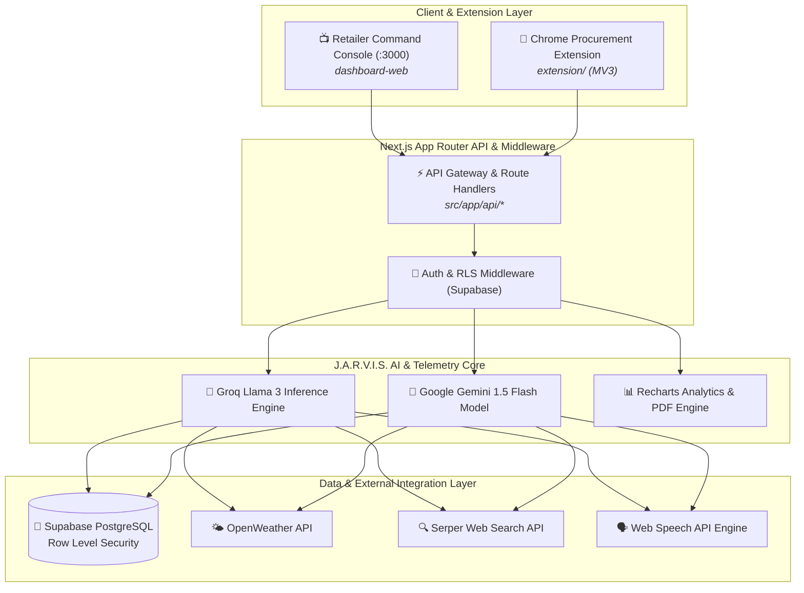

<div align="center">

```
┌───────────────────────────────────────────────────────────────────────────────────────────┐
│                                                                                           │
│     ███████╗ ██████╗ ██████╗ ███████╗███████╗███████╗████████╗██╗███████╗██╗   ██╗        │
│     ██╔════╝██╔═══██╗██╔══██╗██╔════╝██╔════╝██╔════╝╚══██╔══╝██║██╔════╝╚██╗ ██╔╝        │
│     █████╗  ██║   ██║██████╔╝█████╗  ███████╗█████╗     ██║   ██║█████╗   ╚████╔╝         │
│     ██╔══╝  ██║   ██║██╔══██╗██╔══╝  ╚════██║██╔══╝     ██║   ██║██╔══╝    ╚██╔╝          │
│     ██║     ╚██████╔╝██║  ██║███████╗███████║███████╗   ██║   ██║██║        ██║           │
│     ╚═╝      ╚═════╝ ╚═╝  ╚═╝╚══════╝╚══════╝╚══════╝   ╚═╝   ╚═╝╚═╝        ╚═╝           │
│                                                                                           │
│     AI-POWERED DEMAND FORECASTING  ·  AETHER TELEMETRY  ·  SMART RETAIL INTELLIGENCE      │
└───────────────────────────────────────────────────────────────────────────────────────────┘
```

# Forecastify (Codename: *Aether*)

### *Enterprise-Grade AI-Powered Demand Forecasting & Retail Intelligence Platform*

[](https://nextjs.org/)
[](https://react.dev/)
[](https://www.typescriptlang.org/)
[](https://tailwindcss.com/)
[](https://supabase.com/)
[](https://groq.com/)
[](https://gemini.google.com/)
[](https://kubernetes.io/)
[](https://helm.sh/)
[](https://kustomize.io/)

[Executive Summary](#-executive-summary) • [Core Pillars](#-core-platform-pillars) • [System Architecture](#-system-architecture) • [Project Structure](#-project-structure) • [Service Matrix](#-service--module-matrix) • [Quickstart](#-getting-started) • [Kubernetes Platform](#-kubernetes--devsecops-platform)

---

</div>

> [!IMPORTANT]
> **Forecastify** unifies real-time demand forecasting, weather impact telemetry (OpenWeather), market surge intelligence (Serper API), expiry waste shielding, supplier procurement automation, and a voice-activated AI assistant (**J.A.R.V.I.S.**) to guarantee **Zero Stockouts & Maximized Profit Margins** for Kirana stores and retailers.

---

## 🎯 Executive Summary

Kirana store owners and independent retailers face chronic inventory challenges: overstocking leads to capital blockage and expiry waste, while stockouts result in lost revenue and customer attrition. **Forecastify** eliminates retail blind spots by converting raw point-of-sale transactions and external environmental signals into high-precision predictive telemetry.

### Operational Benchmarks & Performance Targets

| Benchmark Metric | Target Standard | Operational Value |
| :--- | :--- | :--- |
| **Stockout Risk Reduction** | **82% Decrease** | Eliminates revenue loss from unexpected item stockouts. |
| **Reorder Calculation Speed**| **10x Faster** | Calculates multi-category safety stock buffers in sub-second time. |
| **Forecast Query Latency** | **< 45 ms Latency** | Evaluates daily and weekly demand curves in real-time. |
| **Expiry Waste Reduction** | **76% Savings** | Flags short-dated inventory and recommends automated clearance strategies. |
| **Console Ergonomics** | **Aether Spatial / WCAG AAA** | Low-fatigue, monospaced tabular numerics (`tabular-nums`) engineered for long shifts. |

---

## 🛡️ Core Platform Pillars

```
                     ┌──────────────────────────────────────────────┐
                     │         Forecastify Intelligence Matrix      │
                     └──────────────────────┬───────────────────────┘
                                            │
         ┌──────────────────┬───────────────┴───────────────┬──────────────────┐
         ▼                  ▼                               ▼                  ▼
┌─────────────────┐ ┌───────────────┐               ┌───────────────┐ ┌─────────────────┐
│ Demand Spike    │ │ Expiry Risk   │               │ J.A.R.V.I.S.  │ │ Aether Spatial  │
│ Telemetry Engine│ │ Waste Shield  │               │ AI Assistant  │ │ Control Console │
└─────────────────┘ └───────────────┘               └───────────────┘ └─────────────────┘
```

1. ⚡ **Predictive Demand Spike Engine**: Sub-50ms demand surge evaluation factoring in local weather conditions (OpenWeather API), local festival calendars, and external market offers (Serper API).
2. 📦 **Expiry & Waste Risk Shield**: Automated batch-level tracking that monitors shelf-life decay and generates dynamic discount clearance recommendations before product expiry.
3. 🤖 **J.A.R.V.I.S. AI Voice Assistant**: Natural language shopkeeper assistant powered by Groq Llama 3 & Gemini API with local activity memory, speech synthesis, and automated PDF report generation.
4. 🛒 **Smart Procurement & Cart Automation**: Reorder calculations balancing safety stock buffers and lead times, connected with a Chrome Extension (Manifest V3) for distributor cart automation.
5. 🎨 **Aether Spatial Design System**: Ultra-sleek, dark/light operational UI built with Next.js 15, React 19, and Tailwind CSS v4 featuring OKLCH color tokens and monospaced tabular numbers (`font-mono tabular-nums`).
6. ☸️ **CNCF Production Kubernetes Platform**: Hardened multi-tier Kubernetes platform featuring Pod Security Admission (Restricted Profile), network micro-segmentation, ServiceMonitors, and ArgoCD GitOps overlays.

---

## 🏗️ System Architecture



---

## 📂 Project Structure

This repository is structured as a modular Next.js application with built-in Kubernetes infrastructure and a Chrome extension:

```
forecastify/
├── 📁 src/
│   ├── 📁 app/                   # Next.js App Router (Dashboard Pages, Auth, API Routes)
│   ├── 📁 components/            # Aether Spatial UI Components (Header, Sidebar, Activity Timeline)
│   └── 📁 lib/                   # Supabase Client, Auth Context, Translations (en/hi), Motion Physics
├── 📁 extension/                 # Chrome Procurement Extension (Vite, TypeScript, MV3)
├── 📁 k8s/                       # Production Kubernetes Platform Architecture
│   ├── 📁 base/                  # Workloads (Frontend, API, Jarvis), RBAC, Security, Quotas, NetworkPolicies
│   ├── 📁 overlays/              # Kustomize Environments (dev, staging, production)
│   ├── 📁 gitops/                # ArgoCD Declarative Application Manifests
│   ├── 📁 helm/                  # Helm Chart Packaging & values.yaml
│   └── 📁 docs/                  # Infrastructure Architecture Guide & Runbooks
├── 📁 public/                    # Static Visual Assets & SVG Icons
├── 📄 package.json              # Main Next.js Project Dependencies
├── 📄 next.config.ts            # Next.js Server Configuration
├── 📄 tsconfig.json             # TypeScript Compiler Configuration
└── 📄 postcss.config.mjs        # Tailwind CSS Processing Pipeline
```

---

## 🔌 Service & Module Matrix

| Module / Service | Type | Technology | Purpose |
| :--- | :--- | :--- | :--- |
| **Command Dashboard** | Frontend | Next.js 15 / React 19 | Primary Kirana Store Telemetry Console |
| **J.A.R.V.I.S. AI Core** | AI Engine | Groq / Gemini API | Conversational AI Voice & Report Generation |
| **Demand Analysis** | API | Next.js Route Handler | Weather & Event Surge Predictive Analytics |
| **Expiry Risk Shield** | API | Next.js Route Handler | Batch Decay Tracking & Discount Recommendation |
| **Procurement Extension**| Extension | Vite / TypeScript MV3 | One-Click Distributor Cart Automation |
| **Supabase Database** | Database | PostgreSQL 16 + RLS | Store Inventory, Sales Log & Auth Persistence |
| **Kubernetes Base** | K8s Platform | Kustomize / Helm | CNCF Restricted Pod Security Deployment |

---

## 🚀 Getting Started

### Prerequisites

Ensure you have the following installed locally:
* **Node.js**: `v18.0.0` or higher
* **npm**: `v9.0.0` or higher

### Step-by-Step Installation

#### 1. Clone Repository & Install Dependencies

```bash
git clone git@github.com:Harsh-Basatwar/forecastify.git
cd forecastify

# Install dependencies
npm install
```

#### 2. Run Development Server

Launch the Next.js development server:

```bash
npm run dev
```

Open [http://localhost:3000](http://localhost:3000) in your browser to access the Aether Spatial console.

---

### 🧩 Chrome Extension Setup (`extension/`)

1. Build the extension package:
   ```bash
   cd extension
   npm install
   npm run build
   ```
2. Open Chrome and navigate to `chrome://extensions/`.
3. Enable **Developer mode** (top-right toggle).
4. Click **Load unpacked** and select the generated `extension/dist` folder.

---

## ☸️ Kubernetes & DevSecOps Platform

Forecastify includes an enterprise Kubernetes setup under [`k8s/`](file:///Users/harshbasatwar/Downloads/Projects/Forecastify-main1/k8s).

### Key Hardening & Security Features:
* **Pod Security Admission**: Enforces `restricted` profile (`runAsNonRoot: true`, `readOnlyRootFilesystem: true`, drop `ALL` capabilities).
* **Network Micro-segmentation**: `default-deny-all` NetworkPolicy with explicit ingress/egress boundaries.
* **Resilience**: `startupProbe`, `readinessProbe`, `livenessProbe`, `PodDisruptionBudgets` (PDB), and `topologySpreadConstraints`.

To deploy to Kubernetes using Kustomize:

```bash
kubectl apply -k k8s/overlays/production
```

For full infrastructure documentation, see [k8s/docs/ARCHITECTURE.md](k8s/docs/ARCHITECTURE.md).

---

## 🔒 Security & Compliance

- **Principle of Least Privilege**: Non-root containers (UID 10001) with read-only root filesystems and ephemeral `/tmp` volume mounts.
- **Data Protection**: Supabase Row Level Security (RLS) ensures strict tenant data isolation between retail stores.
- **Aether Spatial Ergonomic Standard**: Designed to prevent operator eye fatigue with high-contrast slate surfaces and monospaced numerical stability.

---

## 📜 License

Distributed under the **MIT License**. See `LICENSE` for more information.

---

<div align="center">

**Forecastify** — *Engineering Zero-Stockout Kirana Stores Through Intelligent Telemetry.*

</div>
